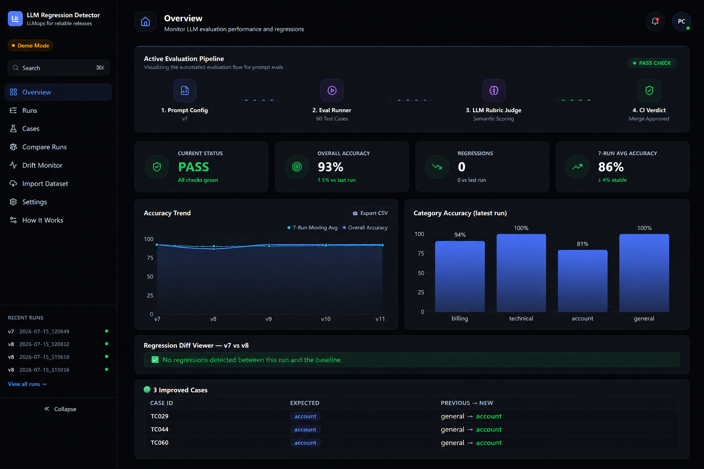
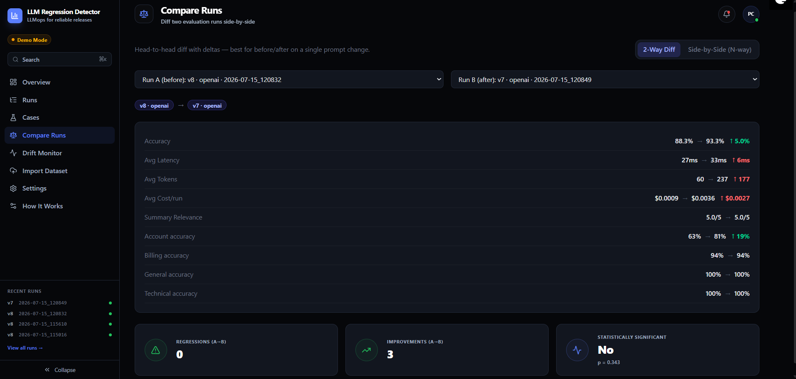
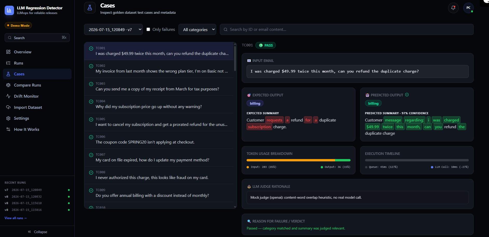
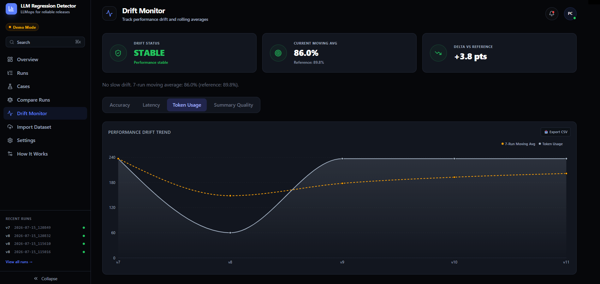

<div align="center">

# 🚀 LLM Model Regression Detection System

**A production-inspired LLM evaluation platform that automatically detects regressions before they reach users.**

It evaluates prompt and model changes against a golden dataset, compares them against previous runs, detects statistically significant regressions, monitors long-term drift, generates interactive reports, and integrates directly into CI/CD — all built from scratch, without Promptfoo, LangSmith, or OpenAI Evals.

[](https://www.python.org/)
[](https://fastapi.tiangolo.com/)
[](https://react.dev/)
[](https://tailwindcss.com/)
[](https://www.docker.com/)
[](https://github.com/features/actions)
[](https://openai.com/)
[](https://www.anthropic.com/)
[](https://ai.google.dev/)
[](https://www.sqlite.org/)

[Demo Video](#) · [Live Dashboard](https://llm-regression-detector.vercel.app) · [Documentation](docs/) · [Architecture](docs/architecture.md)

</div>

---

## 📸 Screenshots

<!--
  Drop PNGs into docs/images/ and swap the paths below. One screenshot per
  page reads best: Overview, Runs, Cases, Compare, Drift, Import Dataset.
-->

| Overview | Compare Runs |
|---|---|
|  |  |

| Cases | Drift Monitor |
|---|---|
|  |  |

---

## ⭐ Highlights

- Built entirely from scratch — no Promptfoo, LangSmith, or OpenAI Evals dependency
- Multi-provider evaluation: OpenAI, Anthropic, and Gemini, run side by side on the same prompt
- Configurable-rubric LLM-as-judge, plus optional embeddings-based semantic similarity
- Statistically rigorous regression detection (two-proportion z-test), not eyeballed thresholds
- Rolling-window drift detection that catches slow degradation no single run would flag
- Two full dashboards: a zero-build Streamlit app and a custom React + FastAPI UI
- GitHub Actions CI/CD: blocks merge on regression, commits accepted results back to `main`
- Slack, Discord, and email alerts — independently configurable, all from one eval run
- Real dataset imports (CSV/JSON) with schema validation, not just static demo data

## 🧩 Key Features

| Feature | Status |
|---|:---:|
| Multi-provider evaluation (OpenAI / Anthropic / Gemini) | ✅ |
| LLM-as-a-Judge with configurable rubric | ✅ |
| Semantic similarity (embeddings) | ✅ |
| Prompt versioning (YAML) | ✅ |
| Statistical regression detection (z-test) | ✅ |
| Rolling drift monitoring | ✅ |
| Interactive dashboard (Streamlit + React) | ✅ |
| CI/CD integration (GitHub Actions) | ✅ |
| Self-contained HTML reports | ✅ |
| Slack / Discord / Email alerts | ✅ |
| Dataset import (CSV/JSON) with validation | ✅ |
| Sign-in gate + demo account for the web dashboard | ✅ |

---

## 🏗 Architecture

```
                     Prompt / Model Change
                              │
                              ▼
                     GitHub Actions CI
                              │
                              ▼
                    Evaluation Engine
              ┌───────────────┼───────────────┐
              ▼               ▼               ▼
           OpenAI         Anthropic         Gemini
              │               │               │
              └───────────────┼───────────────┘
                              ▼
                     LLM-as-a-Judge
                    (configurable rubric)
                              │
                    Statistical Testing
                     (two-proportion z-test)
                              │
                      Drift Detection
                    (rolling N-run window)
                              │
                       SQLite Storage
                    ┌─────────┴─────────┐
                    ▼                   ▼
              Dashboards          HTML Reports
          (Streamlit / React)   (self-contained)
                    │                   │
                    ▼                   ▼
        Slack / Discord / Email   CI Pass or Block
```

Data flows one direction: `prompts/*.yaml` + `golden_dataset/*.json` go
into the eval runner, results land in SQLite, and everything downstream
(reports, both dashboards, alerts) reads from SQLite. There's no hidden
state — full rationale for every one of these choices is in
[`docs/architecture.md`](docs/architecture.md).

---

## ⚡ Quick Demo (no API key required)

The whole pipeline runs in a deterministic **mock mode** out of the box —
useful for demos, onboarding, and CI smoke tests without burning API
credits.

```bash
python -m venv .venv && source .venv/bin/activate
pip install -r requirements.txt
cp .env.example .env          # MOCK_MODE=true by default

python -m src.cli --prompt prompts/v7.yaml
python -m src.cli --prompt prompts/v8.yaml

open data/reports/latest.html                    # self-contained HTML report
streamlit run dashboard/app.py                    # zero-build dashboard
# — or —
uvicorn dashboard-web.backend.main:app --port 8000  # React dashboard (pre-built)
```

This repo ships with a pre-populated `data/eval_results.db` containing a
demo run history so every dashboard has something to show immediately.
A demo account is included in the web dashboard for quick exploration —
delete `data/` to start from a clean slate.

---

## 🌐 Live Demo

- **Dashboard:** [llm-regression-detector.vercel.app](https://llm-regression-detector.vercel.app)
- **API:** [llm-regression-detector.onrender.com/docs](https://llm-regression-detector.onrender.com/docs)

The backend runs on Render's free tier, so the first request after a period of inactivity can take 30–50s to wake up — refresh once it responds. Demo data reflects a snapshot of real eval runs (v7 → v8); running new evals from the hosted dashboard works but won't persist across backend restarts (ephemeral disk on the free tier). For persistent runs, clone and run locally.

---

## 🛠️ Tech Stack

| Layer | Choices |
|---|---|
| **Backend** | Python 3.11+, FastAPI (async), SQLite |
| **Frontend** | React 18, Vite, TailwindCSS, Recharts |
| **DevOps** | GitHub Actions (CI/CD with automated results push-back), Docker + Docker Compose |
| **Evaluation** | OpenAI / Anthropic / Gemini SDKs, Jinja2 (HTML reports), two-proportion z-tests |

---

## 📦 Installation

```bash
git clone <this-repo>
cd llm-regression-detector
python -m venv .venv && source .venv/bin/activate
pip install -r requirements.txt
cp .env.example .env
```

Optional — real providers instead of mock mode:

```bash
# in .env
MOCK_MODE=false
OPENAI_API_KEY=sk-...
ANTHROPIC_API_KEY=sk-ant-...
GEMINI_API_KEY=...
```

Optional — the React dashboard (pre-built `dist/` is already in the repo,
so this step is only needed if you're modifying the frontend):

```bash
cd dashboard-web/frontend && npm install && npm run build
```

Full setup detail (Docker, thresholds, alert channels) is in
[`docs/developer-guide.md`](docs/developer-guide.md).

---

## 🚦 Usage

```bash
# Run an eval
python -m src.cli --prompt prompts/v8.yaml

# Run against a specific provider
python -m src.cli --prompt prompts/v8.yaml --provider anthropic

# Run the SAME prompt across all three providers, side by side
python -m src.cli --prompt prompts/v8.yaml --providers openai,anthropic,gemini

# Import real test cases (CSV or JSON) instead of hand-editing the dataset
python -m src.dataset_importer --file new_cases.csv \
    --output golden_dataset/dataset_v2.json --merge golden_dataset/dataset_v1.json
```

Full CLI reference, dataset schema, and rubric configuration are in
[`docs/dataset.md`](docs/dataset.md) and [`docs/evaluation.md`](docs/evaluation.md).

---

## 📁 Project Structure

```
llm-regression-detector/
├── src/
│   ├── providers/            OpenAI / Anthropic / Gemini / mock adapters behind one interface
│   ├── judge.py               Configurable-rubric LLM-as-judge + semantic similarity
│   ├── llm_feature.py         The feature under test (email classifier)
│   ├── eval_runner.py         Async test runner, multi-dimensional scoring
│   ├── comparison.py          Diff logic + two-proportion z-test
│   ├── drift.py               Rolling-average slow-drift detector
│   ├── storage.py             SQLite persistence
│   ├── report_generator.py    Self-contained HTML diff report
│   ├── slack_alert.py / discord_alert.py / email_alert.py
│   ├── dataset_importer.py    CSV/JSON → golden dataset, with validation
│   └── cli.py                 Orchestrates the pipeline, exits non-zero on FAIL
├── dashboard/app.py           Streamlit UI
├── dashboard-web/
│   ├── backend/main.py        FastAPI — thin read layer over src/
│   └── frontend/src/
│       ├── pages/             Overview, Runs, Cases, Compare, Drift,
│       │                      DatasetUpload, Settings, Auth, HowItWorks
│       └── components/        Sidebar, MetricCard, TrendChart, BarChartPanel,
│                              CommandPalette, PipelineVisualizer, Skeleton
├── prompts/*.yaml             Versioned prompt configs
├── golden_dataset/
│   ├── dataset_v1.json        Hand-labeled ground truth
│   └── judge_rubric.yaml      Configurable judge criteria + weights
├── tests/
├── .github/workflows/         CI/CD pipeline
└── docs/                      Deep-dive documentation (see below)
```

---

## 📚 Developer Docs

The full detail lives in `docs/` instead of a 1,000-line README:

- [`docs/architecture.md`](docs/architecture.md) — design rationale: why diff against the previous run, why SQLite, why LLM-as-judge, why block on FAIL but not WARNING, full CI/CD flow
- [`docs/evaluation.md`](docs/evaluation.md) — exactly what computes every number: rubric-driven judging, semantic similarity, multi-provider judging, confidence scoring, what's deliberately *not* implemented
- [`docs/dataset.md`](docs/dataset.md) — golden dataset schema, how to add cases by hand or import in bulk
- [`docs/developer-guide.md`](docs/developer-guide.md) — mock mode internals, threshold tuning, Docker, extending this to your own LLM feature, local dev notes

---

## 🗺️ Roadmap

- ✅ Multi-provider evaluation
- ✅ Drift detection
- ✅ Configurable LLM-as-judge
- ✅ React dashboard
- ⬜ PostgreSQL option for multi-writer deployments
- ⬜ Distributed eval workers for large datasets
- ⬜ REST API authentication (beyond the dashboard sign-in gate)
- ⬜ Kubernetes deployment manifests
- ⬜ Expanded benchmark suite (currently one feature domain)

---

<div align="center">

Built as a from-scratch alternative to existing eval platforms — see
[`docs/architecture.md`](docs/architecture.md) for the reasoning behind
every major decision.

</div>